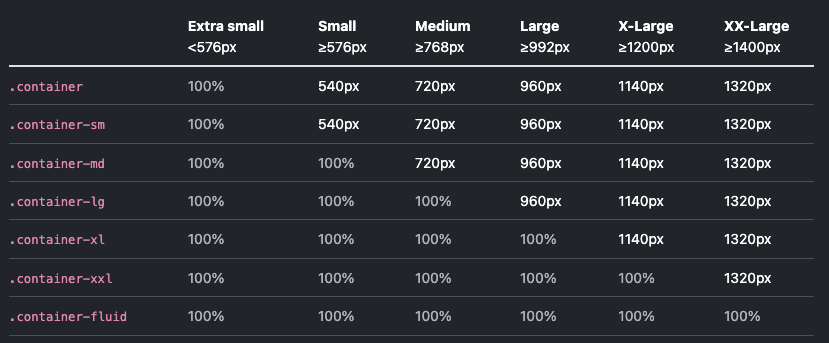

[Bootstrap官方地址](https://getbootstrap.com/)

## 安装Bootstrap

CDN地址:

```html
<link href="https://cdn.jsdelivr.net/npm/bootstrap@5.3.2/dist/css/bootstrap.min.css" rel="stylesheet" integrity="sha384-T3c6CoIi6uLrA9TneNEoa7RxnatzjcDSCmG1MXxSR1GAsXEV/Dwwykc2MPK8M2HN" crossorigin="anonymous">

<script src="https://cdn.jsdelivr.net/npm/bootstrap@5.3.2/dist/js/bootstrap.bundle.min.js" integrity="sha384-C6RzsynM9kWDrMNeT87bh95OGNyZPhcTNXj1NW7RuBCsyN/o0jlpcV8Qyq46cDfL" crossorigin="anonymous"></script>
```

通过npm安装到本地项目:

```bash
npm install bootstrap@5.3.2
```

bootstrap图标:

```bash
npm i bootstrap-icons
```

### 在vite项目中安装Bootstrap

Bootstrap项目在使用`dorpdowns`, `popovers`等功能的时候需要依赖`popper`库, 如果不准备使用这些功能可以仅安装Bootstrap和sass.

```bash
npm i --save bootstrap @popperjs/core
npm i --save-dev sass
```

其他配置根据项目需要进行设置即可. 更多内容可以查看[完整vite+bootstrap文档](https://getbootstrap.com/docs/5.3/getting-started/vite/)

推荐插件:

* `Bootstrap5`:全名就是这个, 可以直接通过`bs5-*`来快速创建bs5模板代码, 也可以在标签的`class`属性中通过`.`来开启bs5智能提示, 诸如`text-decoration-line-through`这种反人类的类名就不用手敲了.
* `IntelliSense for CSS class names in HTML`: css类名的智能提示, 在标签中的`class`属性编写时直接输入不会显示, 需要先输入一个空格, 然后输入类名便会有自动补全.

## 字体与颜色

bootstrap提供了很多常用的文字样式类, 常用的包括:

* h1~6: 设置文字的样式为h1~h6, 在任意标签上添加, 使其文字显示效果与`<h1>`等标签相同;
* display-1[:6]: 作用于`h1[:6]`类相同, 区别在于文字字号更大, 同时字体没有加粗;
* lead: 引文样式, 用更大的字号来显示引文内容, 常见于文章开头的概述等;
* text-center|end|start: 文字对齐方式;

## 按钮与按钮组

除了`button`标签可以用作按钮以外, a,div等标签也可以用作按钮. 但在使用bootstrap按钮时, 首先要通过`btn`来定义一个按钮标签. 然后为按钮添加样式子类.

颜色子类:

* btn-primary
* btn-secondary
* 等等

尺寸子类:

* btn-lg
* btn-sm

样式子类:

* btn-outline-*
* btn-link
* btn-close
* 等等

```html
<h2>Button & Button group</h2>
<button class="btn btn-primary">primary button</button>
<button class="btn btn-secondary">secondary button</button>
<a href="#" class="btn btn-info">a link tag as button</a>
<a href="#" class="btn btn-lg btn-danger">large danger button</a>
<div class="btn btn-sm btn-outline-success">div button</div>
<div class="btn btn-close"></div>
```

### 按钮组

按钮组所包含的按钮会自动消除间距, 比如利用按钮组制作一个分段选择器.

```html
<div class="btn-group">
    <div class="btn btn-outline-primary rounded-start-5">
        section 1
    </div>
    <div class="btn btn-primary">section 2</div>
    <div class="btn btn-primary rounded-end-5">section 3</div>
</div>
```

## 工具类

bootstrap提供了大量的工具类来辅助进行快速布局, 比如内外边距, 边框, 阴影等.

### 间距

* m-*: 所有方向的间距
* mx/y-*: 水平, 垂直间距
* ms/e/t/b-*: 独立设置各个方向的间距, s/e表示start/end.
* m-lg/sm/md-*: 响应式间距.

padding与margin设置方式相同, 把m换成p即可.

```html
<div class="bg-primary m-1 p-1 text-white">
    small margin and padding
</div>
<div class="bg-primary m-5 p-5 text-white">
    large margin and padding
</div>
```

### 边框

添加边框:

* border: 完整默认边框
* border-top | bottom | start | end: 独立设置边框
* border-1[:5]: 设置边框粗细, 也可以独立设置某一边框的粗细
* border-primary | ... : 设置边框颜色.

### 圆角

通过`rounded`及其子类为元素设置圆角

* rounded
* rounded-[start|end|top|bottom]-[0:5]
* rounded-[start|end|top|bottom]-[circle|pill]
* rounded-[circle|pill]

```html
<div class="m-3 p-3 border">Lorem ipsum dolor sit amet.</div>
<div class="m-3 p-3 border-top border-start">
    Lorem ipsum dolor sit amet.
</div>
<div class="m-3 p-3 border-start border-success">
    Lorem ipsum dolor sit amet.
</div>

<div class="m-3 p-3 border-start border-danger border-5">
    Lorem ipsum dolor sit amet.
</div>

<div class="m-3 p-3 border rounded-pill border-3">
    Lorem ipsum dolor sit amet.
</div>
```

### 阴影

* shadow
* shadow-[sm | lg]

### 文字样式

* fw-[bold | bolder | thin | ...]: 字体重量, 从最细到最粗5个选项;
* fst-italic: 仅有一个斜体样式, 没有其他变体;
* fs-[1:5]: 文字大小, 1~5以此递减;
* text-decoration-[underline | line-through]: 文字的下划线和删除线样式.

### 显示与隐藏

可以通过`d-[none | block]`来控制元素的显示与隐藏, 通常来说会配合响应式参数来一同使用

* d-none: 默认隐藏
* d-sm-block: 在到达sm尺寸时显示

## bootstrap容器

bootstrap容器是非常常用的布局工具. 所有的容器均包含了bs内置的响应式设置, 并且可以进行嵌套.

container会根屏幕的尺寸自动调整自身的宽度, 具体的尺寸见下表:



* .container: 在所有视图断点下固定尺寸
* .container-{breakpoint}: 在到达特定的视图断点后固定尺寸, 否则100%;
* .container-fluid: 始终保持100%;

## 网格布局

网格布局要在`container`容器之中, 通过`row`定义行, `col`定义列. 在bootstrap中使用的是12列布局. 每一行包含12个列.

如果仅通过`col`定义列, 则会通过同一行中列元素的总数进行等分. 比如3个`col`元素, 每个元素占4列. 也可以通过`col-n`定义每个列所占的具体列数.

同时可以通过`sm | lg | md`等响应式标签定义不同的单元格在不同尺寸的屏幕下所占用的列数.

当屏幕尺寸很大, 内容不足以占满整列时, 可以通过`justify-content-[start|end|center]`来调整主轴布局.

类似于css的flex布局, 也可以使用`align-items-*`来调整交叉轴方向的布局.

`col`也可以在`row`元素之外单独使用.

```html
<div class="container-lg">
    <h3>responsive</h3>
    <div class="row justify-content-center">
        <div class="col-sm-12 col-md-6 col-lg-4 col-xl-3">
            <div class="p-2 m-2 bg-primary text-white">
                Lorem ipsum dolor sit amet.
            </div>
        </div>
        <div class="col-sm-12 col-md-6 col-lg-4 col-xl-3">
            <div class="p-2 m-2 bg-primary text-white">
                Lorem ipsum dolor sit amet.
            </div>
        </div>
        <div class="col-sm-12 col-md-6 col-lg-4 col-xl-3">
            <div class="p-2 m-2 bg-primary text-white">
                Lorem ipsum dolor sit amet.
            </div>
        </div>
    </div>
</div>
```
